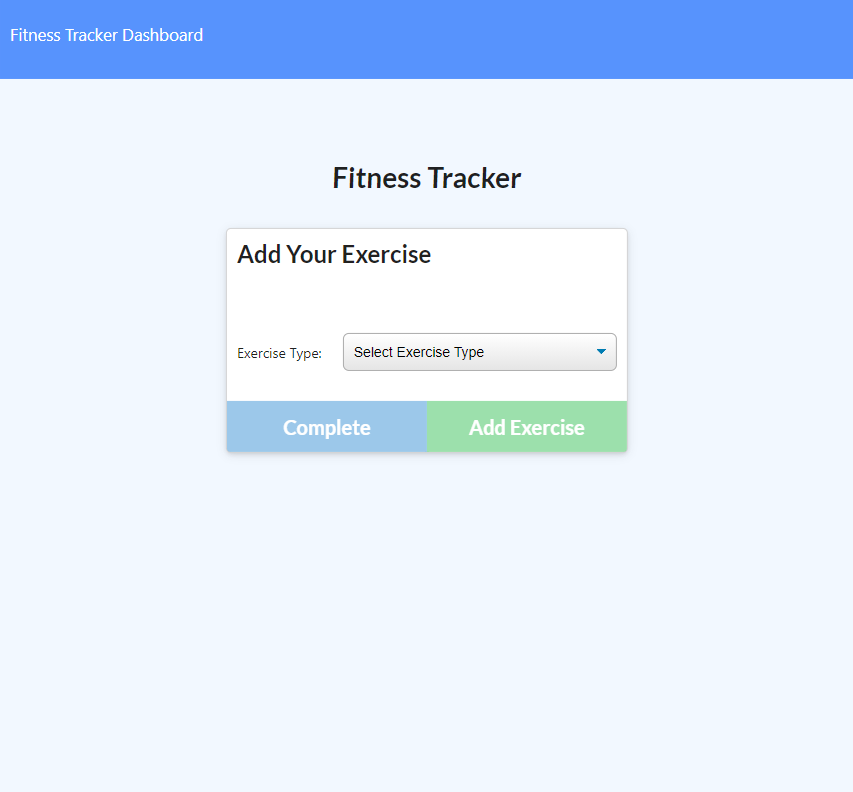

# FITNESS TRACKER

## DESCRIPTION
The fitness tracker allows you to track your workouts by adding resistance or cardio exercises to a new workout or update an existing. You can also see your fitness stats on the workout dashboard.

## INSTRUCTIONS
**Adding a new workout**
- Click on the "new workout" button to add a new work out. - Then use the exercise type dropdown menu to select the type of exercise you'd like to add to your work out (resistance or cardio)
- Fill out the fields for resistance or cardio then click "add exercise" to add it to your work out.
- Click "complete" once you've finished adding all the exercises you need to add to your work out.

**Updating your last workout**
- Click on "continue workout"
- Update your workout by adding an exercise with the "add exercise" button just like the instructions above.
- When you are done, click the "complete" button to save the workout.

**Viewing your stats**
- Click on the "Dashboard" link to the top left to view your workout dashboard.

## LINK
https://bt-fitness-tracker.herokuapp.com/

## SCREENSHOT

